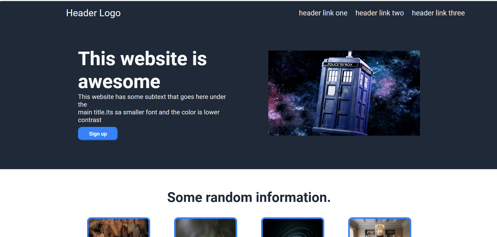
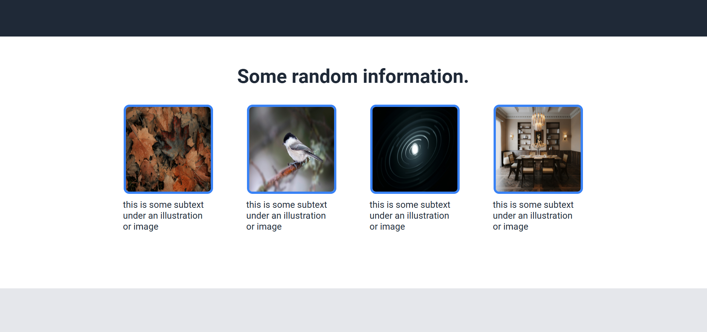
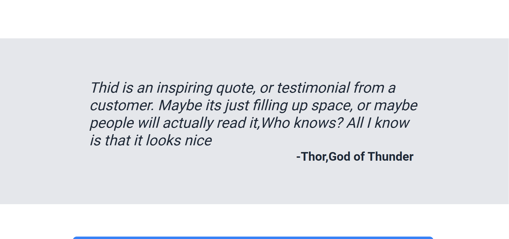
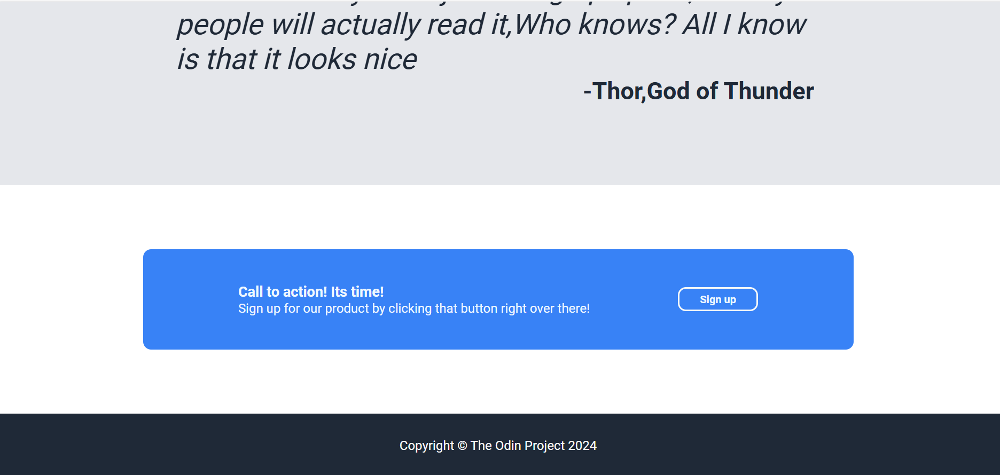

# Odin Landing Page Project

## 🚀 Live Demo
[View Live Site](https://harsh825.github.io/Odin-landing-page/)

## 📝 Description
A landing page implementation created while following The Odin Project's web development curriculum. This project demonstrates fundamental web development skills through a clean, modern design.

## ✨ Features
- Responsive layout using CSS Flexbox
- Modern hero section design
- Information cards showcasing key features
- Quote/testimonial section
- Call-to-action button
- Footer with links

## 🛠️ Technologies Used
- HTML5
- CSS3
- Flexbox

## 📚 Learning Outcomes
- Implementing layouts with CSS Flexbox
- Working with CSS selectors and properties
- Creating responsive designs
- Following design specifications

## 🎯 Original Design
This project is based on The Odin Project's [landing page assignment](https://www.theodinproject.com/lessons/foundations-landing-page).

## 📸 Screenshots
<div align="center">
  
  <br><br>
  
  <br><br>
  
  <br><br>
  
</div>

## 🚀 Installation
1. Clone the repository:
```bash
git clone https://github.com/HARSH825/Odin-landing-page.git
